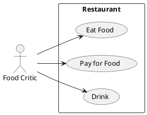

# Описание требований и архитектуры

## Введение
<!-- Общее краткое описание создаваемой системы -->
В рамках курса осуществляется проектирование решения на основе [постановки задачи от "заказчика"](../../task.md).

- [Описание требований и архитектуры](#описание-требований-и-архитектуры)
  - [Введение](#введение)
  - [Заинтересованные стороны](#заинтересованные-стороны)
  - [Бизнес-контекст (бизнес-требования)](#бизнес-контекст-бизнес-требования)
  - [Глоссарий](#глоссарий)
  - [Модель предметной области](#модель-предметной-области)
  - [Требования к системе](#требования-к-системе)
    - [Сценарии использования (Use case)](#сценарии-использования-use-case)
    - [Функциональные требования](#функциональные-требования)
    - [Нефункциональные требования/Требования к атрибутам качества](#нефункциональные-требованиятребования-к-атрибутам-качества)
    - [Ограничения](#ограничения)

  
## Заинтересованные стороны
<!-- Перечень заинтересованных сторон и их интересов по отношению к создаваемой системе. 
Подробнее: https://confluence.mts.ru/pages/viewpage.action?pageId=399975538 
-->
| Заинтересованная сторона | Интересы           |
|:-------------------------|:-------------------|
| Выступающий               | Заявить о своем продукте |
| Контент менеджер               | Модерация контента в рамках планируемой конференции |
| Администратор              | Технический контроль конференции |
| Фасилитатор              | Управление расписанием, сбор обратной связи |
| Партнер               | Просмотр конференции, получение ответов на интересующие вопросы |
| Слушатель               | Просмотр конференции, получение ответов на интересующие вопросы |
| Руководитель проекта               | Общий контроль |

## Бизнес-контекст (бизнес-требования)
<!-- Общее описание бизнес-контекста создаваемой системы (автоматизируемой деятельности), список бизнес-целей заинтересованных сторон 
Подробнее: https://confluence.mts.ru/pages/viewpage.action?pageId=399973845
-->
| Бизнес-требования | 
|:-------------------------|
| BR-INV-01: Для увеличения стоимости бренда, необходимо регулярно привлекать новых партнеров и высококвалифицированных сотрудников с помощью конференций|
| BR-INV-02: Тема конференций должна определяться исходя из текущих рыночных трендов и внутренних продуктов |

## Глоссарий
<!-- Содержит основные понятия и термины предметной области  
Подробнее: https://confluence.mts.ru/pages/viewpage.action?pageId=375782595
-->
| Понятие                        | Сокращение                         | Определение                       |
|:-------------------------------|:-----------------------------------|:----------------------------------|
| *Термин, обозначающий понятие* | *Сокращение термина (при наличии)* | *Развернутое определение понятия* |

## [Модель предметной области](data/data.md)

## Требования к системе

### Сценарии использования (Use case)
<!-- Подробное описание сценариев использования системы с привязкой к ролям участников и задействованным бизнес-сущностям 
https://confluence.mts.ru/pages/viewpage.action?pageId=375782108 
https://confluence.mts.ru/pages/viewpage.action?pageId=375782119 
-->
#### Диаграмма сценариев использования (Use Case Diagram) <!-- omit in toc -->

#### Список сценариев использования <!-- omit in toc -->

| ID     | Описание                                          |
|--------|---------------------------------------------------|
| UC.001 | *[Название сценария использования](uc/uc.001.md)* |

### Функциональные требования
<!-- Описание требований к функциям, реализуемым системой. Требование может быть привязано к сценарию использования или быть общим 
Подробнее: https://confluence.mts.ru/pages/viewpage.action?pageId=375782501 
-->
| ID     | Система должна позволять            | Функциональный блок                        |
|--------|---------------------------------------|---------------------------------------|

| FR.002 | Выступающим загружать свой доклад | Работа с докладчиками |
| FR.003 | Выступающим получать обратную связь | Работа с докладчиками |
| FR.004 | Контент менеджерам ознакомиться с выступающим и его докладом | Работа с докладчиками |
| FR.005 | Контент менеджерам давать обратную связь выступающим | Работа с докладчиками |
| FR.006 | Контент менеджерам проставлять рейтинг выступающему | Работа с докладчиками |
| FR.007 | Контент менеджерам проставлять рейтинг докладу | Работа с докладчиками |
| FR.008 | Фасилитатору создавать расписание конференции на основе рейтингов выступающего и доклада | Работа с расписаниями |
| FR.009 | Фасилитатору контролировать выступление участников конференции | Работа с расписаниями |
| FR.010 | Фасилитатору просматривать задаваемые вопросы | Проведение конференции (трансляция, сбор обратной связи) |
| FR.011 | Фасилитатору просматривать оценки конференции задавать вопросы| Проведение конференции (трансляция, сбор обратной связи) |
| FR.012 | Партнеру/слушателю регистрироваться| Проведение конференции (трансляция, сбор обратной связи) |
| FR.013 | Партнеру/слушателю оценивать конференцию | Проведение конференции (трансляция, сбор обратной связи) | 
| FR.014 | Партнеру/слушателю задавать вопросы | Проведение конференции (трансляция, сбор обратной связи) |
| FR.015 | Администратору мониторить трансляцию конференции | Проведение конференции (трансляция, сбор обратной связи) |
| FR.016 | Администратору использовать несколько каналов трансляции | Проведение конференции (трансляция, сбор обратной связи) |
| FR.017 | Руководитель конференции | Проведение конференции (трансляция, сбор обратной связи) |

### Нефункциональные требования/Требования к атрибутам качества
<!-- Требования к основным архитектурным характеристикам (атрибутам качества) системы - надежность, масштабируемость, ИБ, и др.
Подробнее: https://confluence.mts.ru/pages/viewpage.action?pageId=375782530
-->
| ID     | Атрибут качества             | Описание требования                       |
|--------|------------------------------|-------------------------------------------|
| QR.001 | *Название атрибута качества* | *Описание требования к атрибуту качества* |

### Ограничения
<!-- Описываются ограничения, оказывающие влияние на архитектуру системы - временные, финансовые, технологические
Подробнее: https://confluence.mts.ru/pages/viewpage.action?pageId=375782592
-->
| ID     | Ограничение            |
|--------|------------------------|
| AC.001 | *Описание ограничения* |